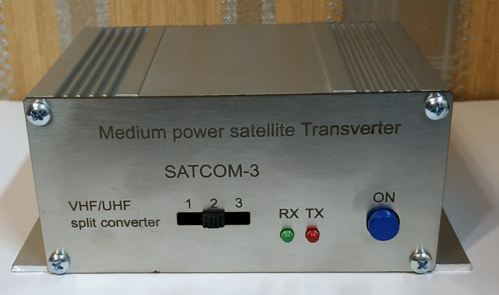
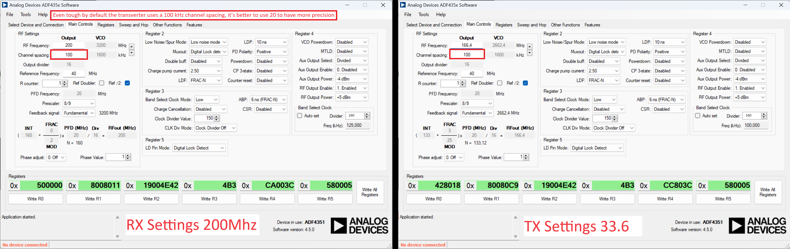

### This repo collaborates with the [Satcom radio](http://satcomradio.github.io) website!
Plase check it's [transverters](https://satcomradio.github.io/#/transverters/index) section for more info.

# [UR3LMZ](mailto:ur3lmz@gmail.com) Transverter Controller

Repo for controlling the [UR3LMZ](mailto:ur3lmz@gmail.com) transverter made by Alexander.  
It also uses a customized and simple [ADF4351 library](./Library).

With this code you will be able to configure the RX and TX offsets.  

-----

This allows a very narrow band radio like the *Icom 9700* to work on satcom frequencies using this transverter.  
You can even set a radio to a fixed frequency like 440mhz and then just control it's RX/TX frequency only using the offsets.

-----

It's important to note that for the UHF transverter, the offsets **decrease** the frequency and for VHF **increases** it.

Check the images in the [Doc](./Doc) folder of the repo to see how the default firmware (checked with a logic analyzer) 
configures the registers for RX and TX of the ADF4351.  

Be sure to check also the [datasheet](./Doc/adf4351.pdf) of the ADF.

## Arduino sketches

In the [Sketches](./Sketches) folder you will find 3 sketches.

1. `AttinyIndependent`
This sketch allows you to upload the code to the attiny and configure the frequencies you want in the selector.  
Use the [ADFSoftware](./ADFSoftware) to calculate the registers and insert them in **reverse** order (from R5 to R0) as done in the default sketch.  
In most cases, you'll only need to modify the register 0 and 1.

2. `AttinySlave`
This sketch makes the Attiny a slave of an arduino. It only tells the arduino using UART if it's in RX (0) and when it is transmitting, in what position you have the selector (1-3).

3. `ArduinoController`
Upload this sketch to an arduino and you'll be able to control the transverter. It basically recieves the status from the 
AttinySlave and set the configured frequencies using an [ADF4351 library](./Library).  
Feel free to expand this sketch to add a **screen controller** using encoders or whatever idea you may have.

In order to compile any of the Attiny sketches with an **Arduino UNO**:

1. Install the [microcore](https://github.com/MCUdude/MicroCore) board to be able to compile Attiny code.
2. Copy the [ADFLibrary](./Library) into your arduino libraries folder.
3. Upload the example `Arduino ISP` sketch into your ardino board
4. With the transverter turned **OFF**. Connect the pins to the transverter board following this [picture](./Doc/adf_pinout.jpg)  
	`MOSI - 11, MISO - 12, CLK - 13, RESET - 10, 5V and GND`
5. Upload the Attiny sketch with `Sketch -> Upload using programmer` selecting the Attiny13 as board.

## Final notes

- In case you want to increase the output power of the transverter, you can drive it at 9V to get a 1W output and feed with it the bias of an 
[amplifier](https://satcomradio.github.io/#/amplifiers/index).  

- It's recommended to install a fan, replace the back cover with an aluminium plate or at least [add a heatsink](./Doc/temperature_fix.jpg).

- You can use a spectrum analyzer to check the frequencies of the ADF on the [first pin of the output pins](./Doc/adf_pinout.jpg).  
If you're using a tinySA consider using an attenuator as it's output is +7dbm and it's close to it's limit.

- If you want to check the output frequency of the transverter without using the internal amplifier, you can [remove the jumper](./Doc/disable_amplifier.jpg).
